# 2025's Top 17 Best Packaging Design Tools

Packaging design used to mean endless back-and-forth with designers, expensive photoshoots for product shots, and crossing your fingers that the final printed box actually matches what you approved. These days, you can skip all that drama. Modern packaging design tools let you generate accurate dielines in minutes, visualize your design on realistic 3D mockups, and export production-ready files—all from your browser, no installation needed.

Whether you're launching a new product line, pitching packaging concepts to clients, or just need quick mockups for your online store, these platforms handle everything from structural design to photorealistic rendering. You'll discover which tools work best for different scenarios, what sets each one apart, and how to get professional results without touching traditional CAD software.

---

## **[Pacdora](https://www.pacdora.com)**

All-in-one online platform combining dieline generation, 3D mockup editing, and cloud rendering for packaging.

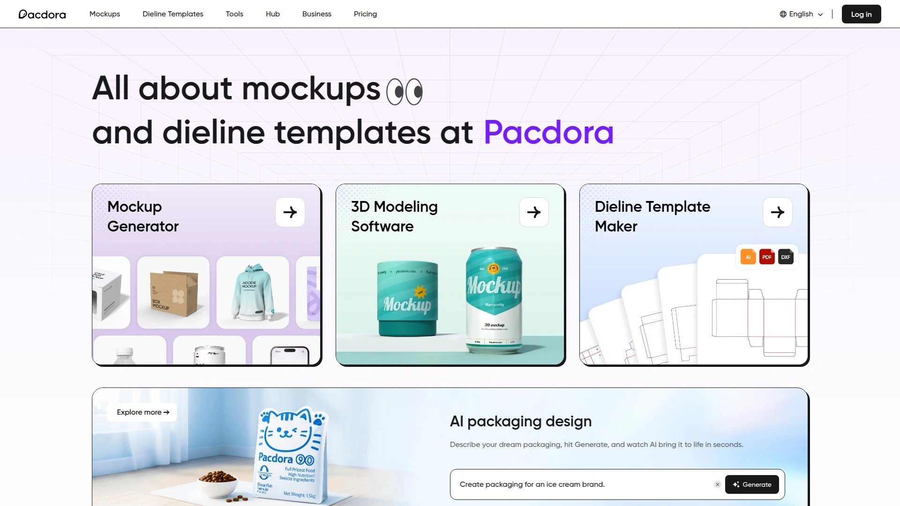

Pacdora operates as a complete packaging design ecosystem where you can generate parametric dielines, customize 3D mockups, and render photorealistic images—all without switching between multiple software packages. The platform maintains the world's largest library of box dielines and packaging mockups, with thousands of pre-built templates covering boxes, bottles, cans, pouches, tubes, and bags. You simply enter your dimensions, and the system generates production-ready dielines in PDF, SVG, AI, and DXF formats with properly marked trim, crease, and bleed lines.

What makes Pacdora different is how it integrates the entire workflow. After generating your dieline, you immediately move to the 3D mockup editor where you upload your artwork and see it applied to a realistic model in real-time. The drag-and-drop interface works like Canva but for packaging—adjust materials, lighting, shadows, camera angles, and export options without technical expertise. The cloud rendering engine produces 4K photorealistic images in under 60 seconds, far faster than local rendering software like Cinema 4D.

The free tier lets you explore all features, test unlimited designs, and download mockup files. Premium subscriptions at $29 monthly unlock unlimited dieline downloads, watermark-free PNG exports, 4K rendering capabilities, and MP4 video exports with folding animations. Pacdora eliminates the traditional workflow where you'd use Illustrator for dielines, then import to 3D software for visualization—everything happens in one place with automatic synchronization between 2D artwork and 3D models.

Students and educators receive special discounts, while enterprise users get volume pricing for multiple seats. The platform particularly excels for eCommerce brands, packaging designers, print shops, and marketing teams who need rapid iteration without the learning curve of professional CAD software.

***

## **[Boxshot](https://boxshot.com)**

Desktop software with 70+ parametric shapes and advanced rendering for product visualization pros.

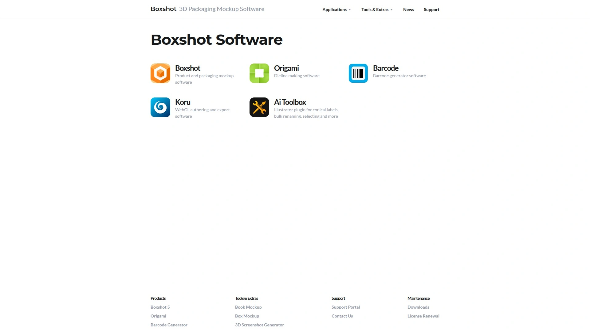

Boxshot functions as your virtual photo studio specifically built for 3D product and packaging mockups. The software includes 70+ customizable shapes ranging from software boxes and hardcover books to CD cases, cans, mugs, bags, and display stands. Each shape adjusts automatically to fit your artwork dimensions—you don't resize images to match templates, Boxshot resizes the 3D models to match your graphics.

**Advanced rendering capabilities:** The built-in path-tracing engine delivers physically-based rendering with HDR processing at 32-bit precision per channel. You can output images up to 16384x16384 pixels with realistic depth-of-field blur, image-based HDR lighting, and configurable shadows. The software reads Adobe Illustrator files, PDFs, and standard image formats while supporting CMYK color spaces and embedded color profiles for print accuracy.

Import external 3D models in FBX, 3DS, OBJ, Collada, STL, PLY, and DXF formats when built-in shapes don't cover your needs. The CAD-like shape tools create symmetrical objects like custom bottles and containers. Boxshot even simulates shrink-wrap film for products with heat-shrink packaging.

Automation features include batch rendering for creating multiple product variations, scripting support through JavaScript for scene control, and command-line operation for server-based rendering. Queue up rendering jobs to process overnight, create turntable animations, or export to OBJ, Collada, and 3D PDF formats for client presentations. Boxshot targets professional designers and agencies who need desktop-grade rendering quality with precise control over every visual element.

***

## **[Adobe Dimension](https://www.adobe.com/products/dimension.html)**

Industry-standard 3D design tool integrating with Creative Cloud for packaging visualization.

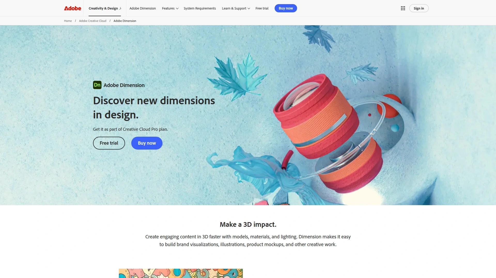

Adobe Dimension simplifies 3D packaging mockup creation for designers already working in the Adobe ecosystem. The software lets you compose 3D scenes, overlay 2D graphics onto product models, and generate photorealistic renders without deep 3D modeling knowledge. Integration with Creative Cloud means your Illustrator artwork, Photoshop designs, and Stock assets sync automatically—no manual file transfers between applications.

The lighting system models real-world physics, giving you studio-quality illumination for any packaging scenario. Start with customizable 3D assets from Adobe Stock, apply your flat artwork as decals, adjust materials and textures, then render high-resolution images suitable for marketing materials. The software eliminates expensive photoshoots by letting you create unlimited scene variations digitally.

Dimension works particularly well for cereal boxes, wine bottles, cosmetic containers, and food packaging where you need multiple angles or seasonal variations. The learning curve sits between simple mockup generators and professional 3D software—accessible enough for graphic designers but powerful enough for client presentations. Pricing runs $19.99 monthly as a standalone app, or it's included with Creative Cloud All Apps subscriptions. Adobe provides extensive tutorials covering 3D model importing, custom packaging templates, and portfolio-worthy product shots.

***

## **[Esko ArtiosCAD](https://www.esko.com/en/products/artioscad)**

Professional structural design software for packaging engineers and manufacturing workflows.

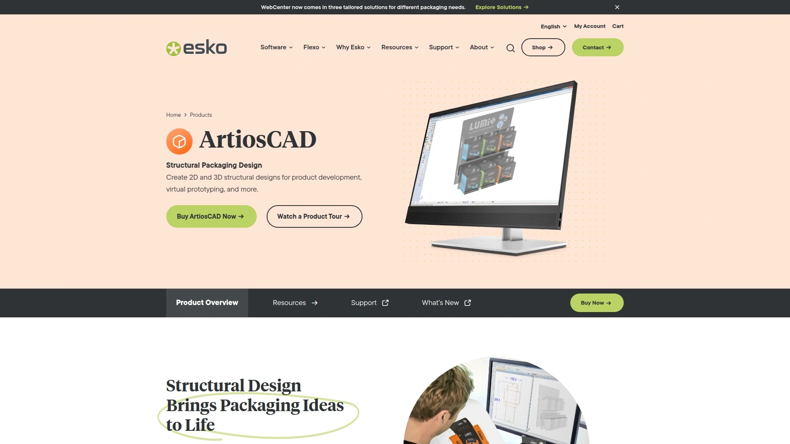

ArtiosCAD dominates the packaging industry as the world's most widely adopted structural design platform. This CAD software handles complete packaging development from initial concept through manufacturing output, specializing in corrugated boxes, folding cartons, and point-of-purchase displays. Unlike mockup tools focused on visualization, ArtiosCAD prioritizes structural accuracy and production specifications.

**Core capabilities include:** Parametric dieline creation with automatic rebuild when dimensions change, intelligent drafting tools ensuring manufacturability, virtual prototyping to catch design flaws before physical production, and interoperability with ProE, STEP, SAT, IGES, SolidWorks, and Siemens NX. The software generates assembly instructions automatically, creates folding sequence animations, and produces detailed reports for manufacturing teams.

The parametric design library includes thousands of ECMA, FEFCO, and display standards that make structural decisions automatically based on your input dimensions. You can visualize designs in 3D before cutting dies, anticipate physical limitations, and communicate effectively across departments. ArtiosCAD users report 75% time savings on projects compared to traditional methods.

This platform serves packaging engineers, structural designers, corrugated manufacturers, and brands with complex packaging requirements. The focus on sustainability helps minimize material waste from design errors and unused prototypes. Pricing follows enterprise licensing models with support for teams and integration into existing production systems.

***

## **[Packhelp](https://packhelp.com)**

Full-service packaging platform combining online design tools with print fulfillment and order management.

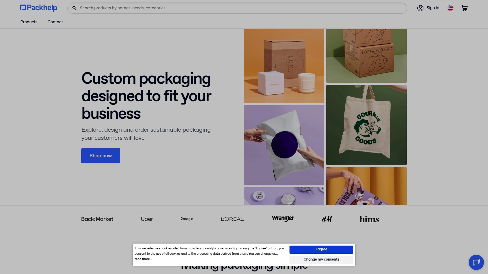

Packhelp operates as more than design software—it's a complete packaging solution connecting design, production, and delivery. The platform serves over 50,000 businesses globally who use its 3D box design configurator to create custom-branded packaging and order directly from verified suppliers. Choose from 5,000+ product configurations covering boxes, bags, mailers, tissue paper, and accessories.

The online editor provides intuitive design creation where you upload logos, add text and images, select materials and finishes, then preview everything in real-time 3D. Pre-made templates accelerate the process for common packaging types. Once you finalize your design, Packhelp connects you with their network of 300+ sustainable suppliers who manufacture and ship your order.

**Integrated features:** API access for connecting to your existing systems, third-party integrations with Shopify, WooCommerce, and BigCommerce for automated order fulfillment, comprehensive shipping tracking, and print quality control across all production runs. The platform handles both custom orders and stock packaging solutions, with flexible quantities to match business needs.

Around-the-clock support through live chat, email, and phone ensures smooth ordering. Pricing varies based on product type, quantity, and customization complexity—the configurator provides instant quotes. Packhelp works best for eCommerce brands, retailers, event planners, and gift packaging businesses who want design simplicity plus reliable manufacturing without managing multiple vendors.

***

## **[3DMockup.co](https://3dmockup.co)**

Free browser-based 3D mockup generator for clothing, packaging, and product visualization.

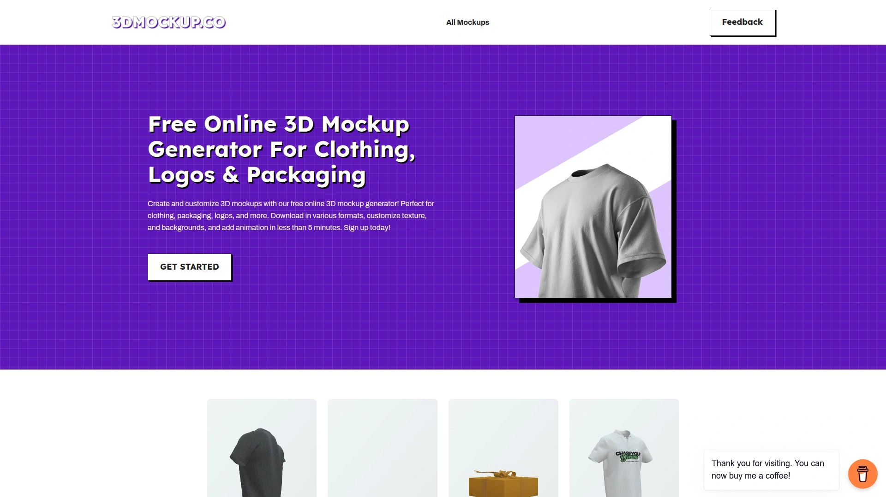

This completely free platform creates realistic 3D mockups for apparel, packaging, logos, and products directly in your browser—no signups required for basic use. The tool provides 1000+ unique templates spanning T-shirts, hoodies, tote bags, mugs, posters, packaging boxes, and more. Upload your design, customize the texture and background, add rotation animations, then download in various formats within five minutes.

The mockup generator lets you rotate products 360 degrees with mouse control to view from all angles. Background customization options create contextual scenes or clean white backups suitable for eCommerce listings. The animation feature produces short video clips showing your product spinning or unfolding—perfect for social media content.

Designers appreciate the speed—what would take hours in Blender or Photoshop happens in minutes here. Startups and entrepreneurs use it for crowdfunding campaigns, Kickstarter visuals, and pre-launch marketing when budgets can't accommodate professional rendering services. The platform targets global users from the USA to Brazil who need quick mockups without software installations.

While the free tier covers most needs, limitations exist on download frequency and export resolution. The straightforward workflow makes 3DMockup.co ideal for rapid concept visualization, social media content creation, and client previews where speed matters more than ultimate rendering quality.

***

## **[ProVisual](https://provisual.app)**

Cloud-based 3D mockup editor with real-time rendering and collaborative features.

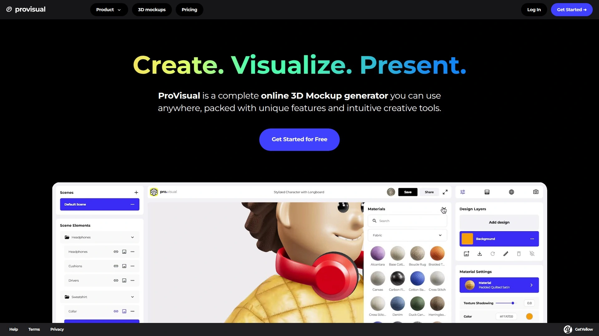

ProVisual delivers a complete online 3D mockup ecosystem with real-time rendering that shows changes instantly as you work. The platform's extensive library covers packaging, devices, apparel, home decor, and more—all customizable through an intuitive creative interface requiring zero 3D experience. Upload designs, adjust materials, modify lighting, change backgrounds, and export high-quality results without ever launching desktop software.

The scene management system lets you create multiple variations of each mockup with different designs, materials, and environmental settings. Work on projects collaboratively by sharing access with team members or clients for feedback. Design layers allow separate control over different artwork elements applied to your 3D model, while the material setup panel provides ready-to-use textures making visualizations realistic.

ProVisual's real-time editing capability means you immediately see modifications to designs, textures, materials, and lighting—no waiting for renders to process. The toolbar provides quick actions for common tasks like rotating models, adjusting camera angles, and toggling display options. Built-in tutorials guide new users through features and workflows.

Weekly updates add new models to the library, keeping options fresh and relevant. The platform suits designers, agencies, and brands who need professional mockups without learning complex 3D software. Cloud storage keeps projects accessible from any device, making it convenient for remote teams and clients who want preview access.

***

## **[Mockey](https://mockey.ai)**

AI-powered free mockup generator with 12,500+ templates and watermark-free downloads.

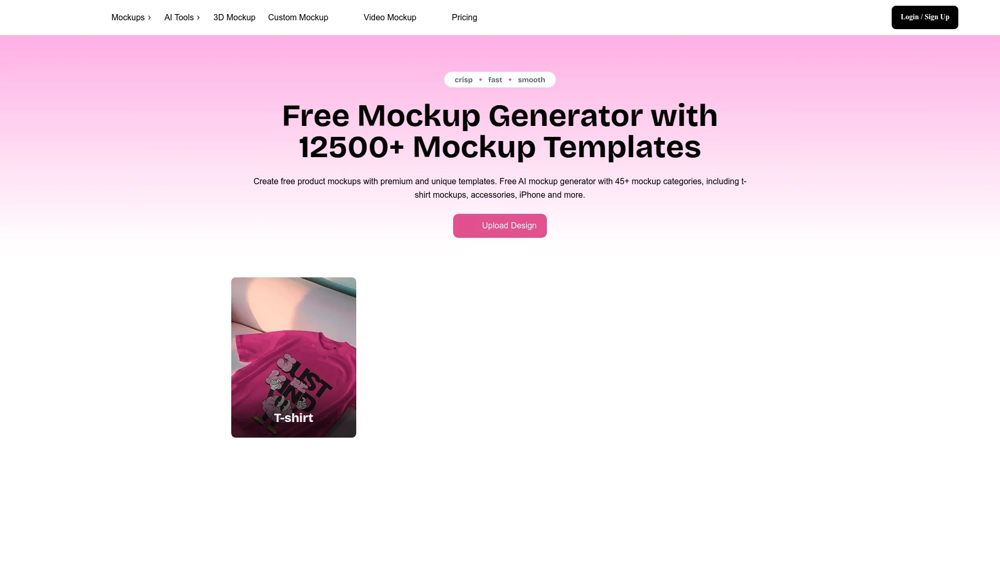

Mockey uses artificial intelligence to simplify mockup creation across 12,500+ templates covering apparel, devices, business cards, stickers, packaging, and more. The platform operates entirely free with optional Pro upgrades—create unlimited mockups, customize backgrounds and colors, download without watermarks, and generate 3D product visualizations in just three steps.

Sign up with your Google account, browse categories, select a template, upload your design, and adjust positioning. The AI automatically adapts your artwork to different product surfaces with realistic perspective and lighting. Real-time editing shows changes immediately without render waits. Export as images or use the Motion feature to create animated MP4 videos showing products rotating or unfolding.

**Free plan includes:** 1000+ mockup templates, basic customization options, three daily downloads in JPG format. Pro plan ($7 monthly, 20% off for yearly subscriptions) removes download limits, unlocks PNG format with transparency, provides higher resolution exports, and grants access to premium templates.

The extensive clothing library supports detailed 3D apparel mockups for T-shirts, hoodies, and other garments. Product categories include packaging boxes, bottles, cans, bags, books, and digital devices. Mockey integrates with Figma through plugins for designers already working in that environment.

Small businesses, print-on-demand sellers, and content creators choose Mockey when they need quick, professional-looking mockups without recurring software costs. The AI assistance reduces manual positioning work while maintaining photorealistic results.

***

## **[Renderforest](https://www.renderforest.com/mockups)**

All-in-one creative platform offering mockup maker alongside video, branding, and design tools.

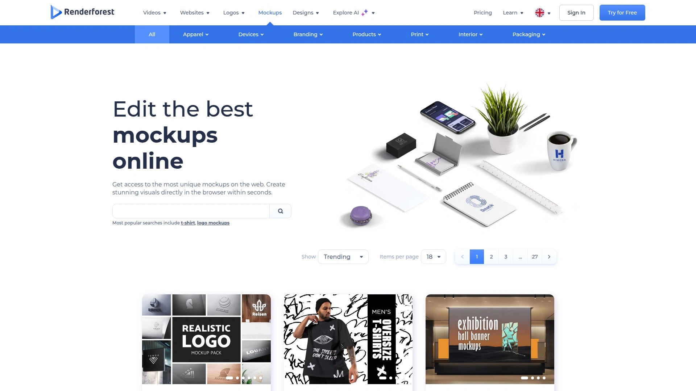

Renderforest provides a comprehensive creative suite where mockup creation sits alongside video editing, logo design, website building, and animation tools. The mockup maker offers thousands of pre-made templates across six main categories: Apparel, Devices, Branding, Products, Interior, and Packaging. Search functionality and trending filters help locate the perfect template quickly.

The drag-and-drop customization interface adjusts colors, uploads designs, modifies text, and repositions elements—all visible in real-time preview. Templates range from simple phone screens to complex packaging sets, branding kits, and environmental scenes. Renderforest particularly excels at themed mockup collections like organic skincare lines, pizza packaging, beauty brand kits, and cardboard box sets.

**Pricing tiers:** Free plan allows testing with watermarked low-resolution downloads. Lite plan ($varying) offers high-resolution exports without watermarks for freelancers and small businesses. Pro plan unlocks full template access, unlimited edits, and multiple file formats for commercial use. Business plan adds advanced branding tools, priority support, and collaboration options for teams and agencies.

The all-in-one approach means you can create mockups, then immediately produce promotional videos, design matching graphics, and build landing pages—all within the same platform. This ecosystem approach saves time for entrepreneurs and small teams managing multiple content types. The user-friendly interface requires no advanced design skills, making professional results accessible to beginners.

***

## **[Smartmockups](https://smartymockups.com)**

Premium mockup generator with 2000+ templates focused on apparel and product visualization.

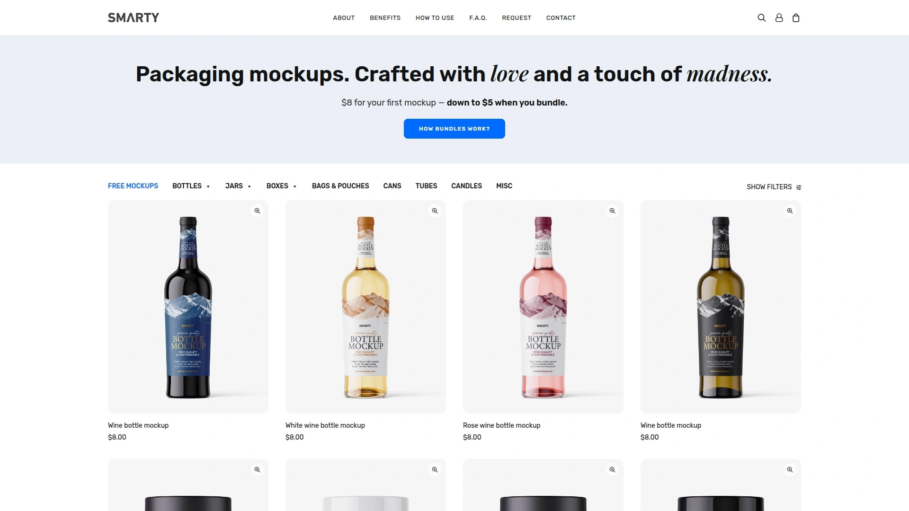

Smartmockups combines a streamlined mockup generator with powerful customization tools covering Technology (smartphones, laptops, tablets, TV screens), Print (business cards, posters, magazines, books), Packaging (cosmetics, food, beverages, bags, boxes), Home and Living (mugs, pillows, candles), and Apparel (T-shirts, hoodies, tank tops, face masks). Despite having fewer total templates than some competitors, the quality and customization depth make up for quantity.

The mockup generator embeds intuitive tools for changing product colors, uploading designs from your device or cloud storage, and adjusting layouts. Seamless integration with Dropbox and Canva lets you pull existing images without separate uploads. Pro subscriptions automatically save all edited templates to your Designs folder, protecting work if you get disconnected during creation.

Pick your product template, customize colors and imagery, position your artwork, then export high-resolution mockups suitable for client presentations and marketing materials. The interface prioritizes ease of use—designers, entrepreneurs, and marketers can all create professional mockups without training. Real-time previews show exactly how adjustments affect the final result.

Smartmockups targets print-on-demand businesses, eCommerce stores, and product designers who need consistent, high-quality mockups across their product catalogs. The generator works well when you need multiple variations of similar products or want to maintain visual consistency across different product types.

***

## **[Placeit](https://placeit.net)**

Massive template marketplace with 55,000+ ready-to-go designs spanning mockups, logos, and videos.

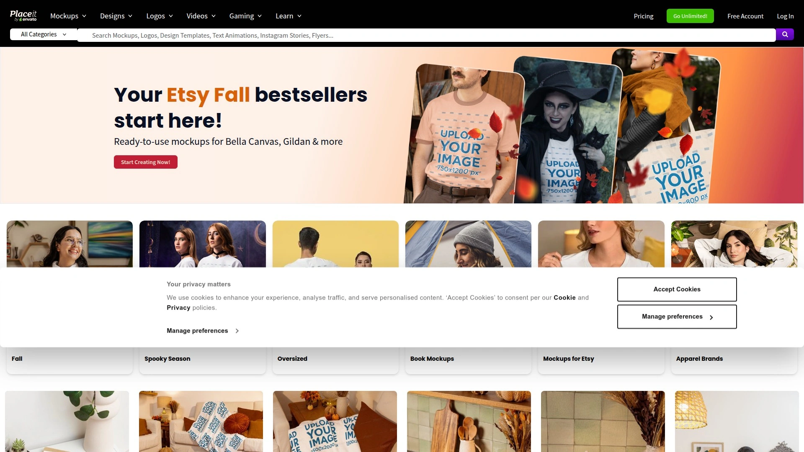

Placeit operates as an enormous creative marketplace featuring more than 55,000 templates across five main categories: Mockups, Designs, Logos, Videos, and Gaming. Each category contains extensive subcategories—the Mockups section alone covers every conceivable product type from digital devices to physical products, apparel, and packaging. The sheer variety means you'll likely find exactly what you need without settling for "close enough."

Beyond templates, Placeit offers tools to start designs from scratch, arranging text, graphics, backgrounds, and images to match your vision. The customization menu adapts based on template type, letting you add, change, edit, and reposition elements while seeing a real-time preview. Color palettes provide unlimited options with both default and custom selections.

Upload images from your device, recent uploads, or Placeit's built-in library. Crop and position artwork, adjust backgrounds, and apply changes that display immediately. AI-powered suggestions recommend similar designs you might like based on your selections. Save projects as drafts in organized folders or share directly to social media platforms.

**Important note:** Downloading finished designs requires an active subscription—the free browsing and editing experience converts to paid access for exports. Placeit works best for designers and businesses needing diverse creative assets beyond just mockups. The monthly subscription covers unlimited downloads across all template categories, making it cost-effective for high-volume users.

***

## **[Canva Mockups](https://www.canva.com/mockups/)**

Integrated mockup generator within the popular Canva design platform for seamless workflow.

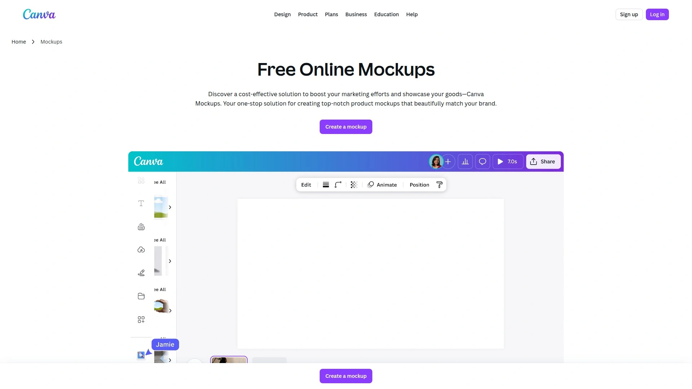

Canva's mockup functionality integrates directly into its main design interface, letting you create product mockups alongside your other graphic design work. Access thousands of pre-made mockup templates for packaging, apparel, devices, and products—all customizable through Canva's familiar drag-and-drop editor. If you're already designing your product graphics in Canva, adding mockups becomes a natural extension without switching platforms.

The 3D packaging mockup generator creates realistic visualizations in just a few clicks. Browse collections covering water bottles, product boxes, pouches, paper bags, cosmetics containers, and more. Upload your artwork, adjust placement, modify colors and materials, then export high-resolution images. The tool saves money on professional photoshoots while providing multiple scene variations for different marketing needs.

**Built-in advantages:** 3 million+ free stock photos and graphics to enhance mockup scenes, easy sharing and collaboration features, responsive design working on desktop, tablet, and mobile devices, and simple download or social sharing options. The intuitive editor requires zero technical skills—if you can use basic design software, you can create professional mockups.

Free Canva accounts access basic mockup templates with watermarked exports and limited resolution. Canva Pro subscriptions unlock premium templates, higher resolution downloads, and watermark removal. The platform particularly suits small businesses, marketers, and entrepreneurs who want an all-in-one solution for graphic design and product visualization without juggling multiple specialized tools.

***

## **[Templatemaker](https://www.templatemaker.nl/en/)**

Free parametric box template generator creating custom papercraft and packaging dielines.

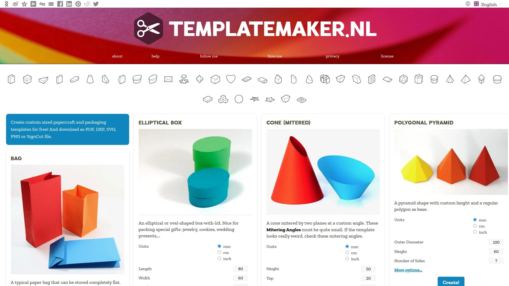

Templatemaker offers completely free dieline generation for custom packaging, boxes, bags, and papercraft projects. Enter your dimensions, select your box style, and the system generates downloadable templates in PDF, DXF, SVG, and PNG formats. The parametric approach means every template adjusts mathematically to your exact specifications without manual redrawing.

The online tool covers dozens of box types including standard cartons, display boxes, cake slice boxes, gift bags, envelopes, and specialty packaging structures. No registration required—just input dimensions and download your files immediately. The simplicity makes Templatemaker perfect for hobbyists, students, small businesses, and anyone needing basic structural templates without investing in expensive CAD software.

While Templatemaker generates accurate dielines, it lacks 3D visualization and mockup capabilities. You'll need to combine it with other tools if you want to preview how your artwork looks on the finished package. The straightforward focus on structural accuracy rather than visualization serves users who know exactly what they need and just want precise cutting templates.

Educational institutions, craft businesses, prototype developers, and DIY enthusiasts rely on Templatemaker for quick dieline generation. The free access removes barriers for experimentation and learning. Export formats work with cutting plotters, laser cutters, and standard printers, making the templates versatile across different production methods.

***

## **[Cefbox](https://www.cefbox.com)**

Online dieline generator creating professional packaging templates from entered dimensions.

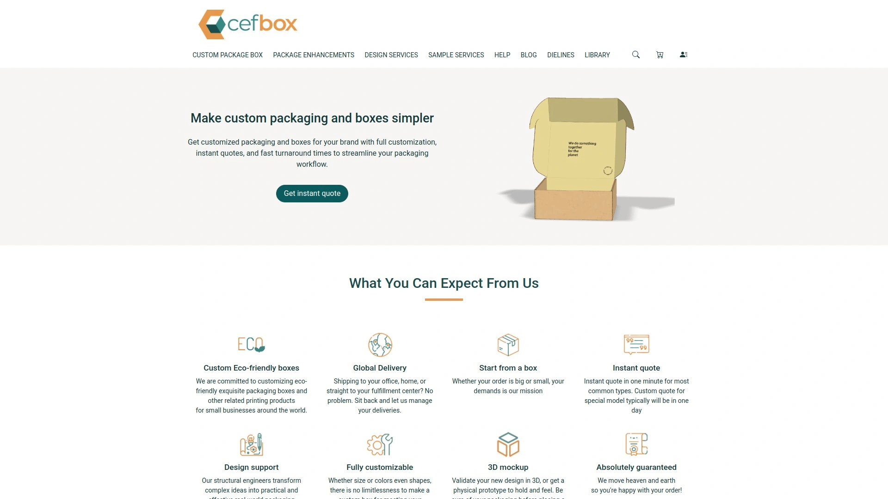

Cefbox streamlines dieline creation by instantly generating production-ready templates when you enter product dimensions. The platform specializes in custom packaging for businesses offering personalized boxes, cartons, and containers. Select your packaging structure, input measurements, and receive downloadable dielines in print-ready formats—no advanced design skills required.

The template library supports various packaging structures suitable for retail boxes, shipping containers, and product packaging. Color-coded dielines clearly distinguish trim lines, crease lines, and bleed areas, ensuring manufacturing accuracy. Print shops appreciate the instant turnaround—clients receive accurate dielines without manual design work.

Cefbox eliminates guesswork by providing precise structural templates that account for material thickness and assembly requirements. The straightforward approach works particularly well for packaging businesses quoting custom projects where clients need rapid prototypes or proof-of-concept visuals before committing to full production runs.

While lacking advanced 3D mockup features, Cefbox excels at its core function: generating accurate dielines quickly. The platform serves packaging manufacturers, print shops, and businesses offering custom packaging solutions who prioritize structural accuracy and fast client turnaround over elaborate visualization.

***

## **[DiecutTemplates](https://www.diecuttemplates.com)**

Professional dieline library providing production-ready packaging templates with customizable dimensions.

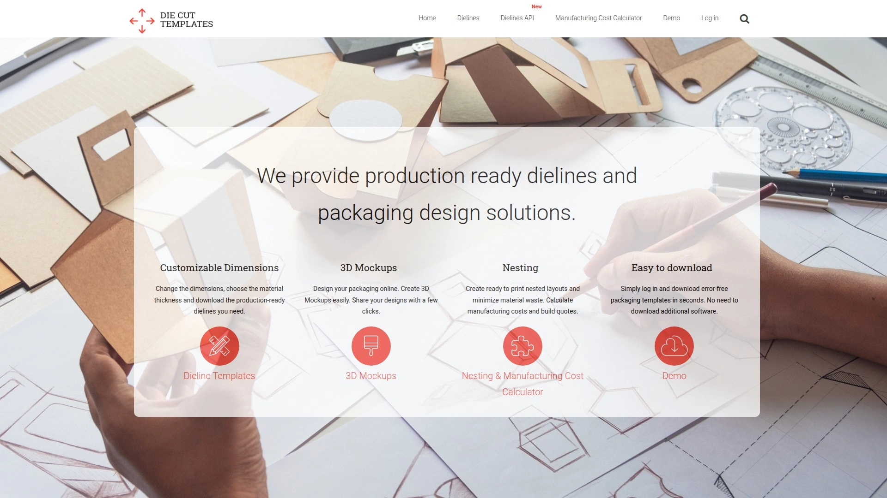

DiecutTemplates focuses exclusively on delivering high-quality, production-ready dielines for professional packaging applications. The platform offers customizable dimensions, material thickness selection, and immediate downloads in industry-standard formats. Each template follows professional specifications ensuring compatibility with commercial printing and die-cutting equipment.

Choose from an extensive library of packaging structures covering retail boxes, display packaging, cartons, and specialty containers. Adjust dimensions to match your product specifications, select appropriate material thickness, and download files ready for manufacturing. The templates include proper annotations for cutting, creasing, and perforations.

This platform targets packaging professionals, print service providers, and manufacturing facilities where accuracy and industry compliance are critical. The templates work immediately with existing production workflows without requiring additional formatting or adjustment. Technical support ensures users understand proper implementation.

DiecutTemplates provides the structural foundation that designers can then embellish with graphics and branding. The professional focus means less emphasis on visualization tools and more on manufacturing precision. Businesses with established design teams who just need accurate structural templates find this approach efficient.

***

## **[Spring by Sourceful](https://www.sourceful.com)**

AI-powered packaging design toolkit generating hyper-realistic concepts from simple text prompts.

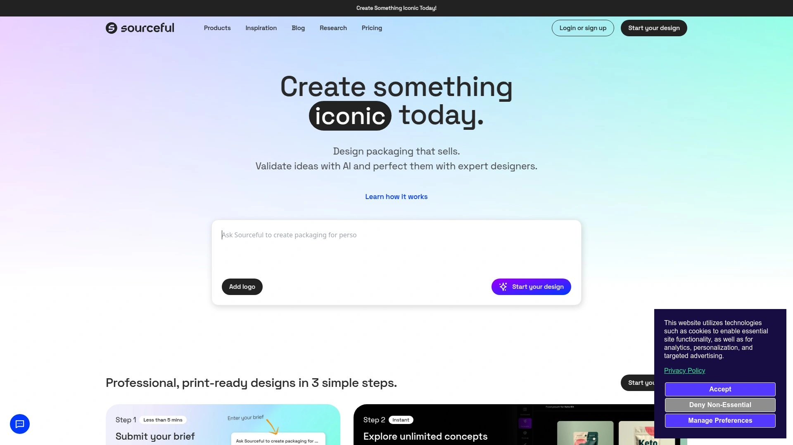

Spring revolutionizes packaging design by using artificial intelligence to generate complete packaging concepts from basic descriptions. Input your brand aesthetics and product details through simple prompts, and the AI produces hyper-realistic 3D mockups without requiring design skills. The platform combines concept generation, real-time editing, and collaboration tools in a unified workspace.

**AI capabilities include:** Instant packaging concept generation from text descriptions, real-time 3D mockup creation with immediate edits, artwork extraction and remixing from images, and a curated template library with industry-specific designs. The AI understands design principles, brand consistency, and industry standards, producing professional results from minimal input.

Real-time editing eliminates software switching—apply artwork to templates, make adjustments, and view changes instantly. The collaboration features let teams and stakeholders share collections, provide feedback, and align on designs before production. This accelerates decision-making and reduces revision cycles.

Spring targets businesses seeking rapid iteration during concept development phases. Marketing teams can generate dozens of variations quickly, test different approaches, and narrow to finalists without extensive designer involvement. The AI assistance democratizes packaging design, making sophisticated concepts accessible to smaller teams and startups with limited design resources.

***

## **[Easy-Peasy.AI Packaging Design Generator](https://easy-peasy.ai)**

AI-powered packaging design generator creating custom visuals from descriptive text prompts.

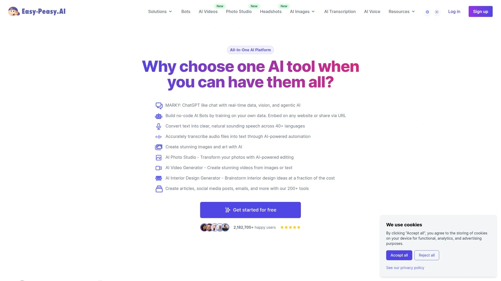

Easy-Peasy.AI offers an intuitive AI-driven tool that generates professional packaging designs instantly from text descriptions. Enter your requirements—product type, brand style, color preferences, design elements—and the AI produces eye-catching packaging visuals suitable for diverse products and brand identities. No design experience necessary.

The platform provides various templates and styles that adapt to your input, creating unique packaging concepts quickly. Generate multiple ideas rapidly, helping you iterate and refine concepts without traditional design timelines. The AI handles composition, color theory, and visual hierarchy automatically while incorporating your specific requirements.

Easy-Peasy.AI integrates with other AI tools in their suite for creating cohesive marketing materials across text, video, and branding. This ecosystem approach lets you develop packaging designs alongside product descriptions, marketing copy, and promotional content—all from the same platform.

Startups and small businesses use Easy-Peasy.AI when they need packaging concepts but lack dedicated designers. The low barrier to entry makes professional-looking designs accessible to entrepreneurs validating product ideas or preparing crowdfunding campaigns. The speed supports rapid experimentation with different aesthetic directions before committing to final designs.

---

## FAQ

**What's the fastest way to generate accurate packaging dielines without CAD software?**

Pacdora's dieline generator creates production-ready templates in under three minutes—select your box type from thousands of options, enter dimensions and material thickness, then download in AI, PDF, or DXF formats ready for printing. Templatemaker and Cefbox offer similar speed for basic structures completely free, while Pacdora provides the largest template variety plus immediate 3D visualization of your generated dieline.

**Can I create photorealistic packaging mockups without learning 3D software like Blender?**

Absolutely. Pacdora, ProVisual, and Mockey all provide browser-based editors where you upload flat artwork and the platform applies it to 3D models automatically. Pacdora's cloud rendering produces 4K photorealistic images in under 60 seconds without any 3D modeling knowledge. For simpler needs, Canva Mockups integrates packaging visualization directly into familiar design workflows, while 3DMockup.co delivers quick results completely free.

**Which platform works best for eCommerce brands needing both design tools and print fulfillment?**

Packhelp combines online 3D design configurators with direct manufacturing from 300+ verified suppliers, handling everything from concept through delivery. You design, preview in 3D, and order—all in one platform with Shopify and WooCommerce integration. For design-only needs without manufacturing, Pacdora provides more extensive dieline and mockup libraries at lower monthly costs, letting you export print-ready files to your preferred supplier.

---

## Conclusion

Choosing the right packaging design tool depends on your specific needs—whether you're generating structural dielines, creating marketing mockups, or managing complete production workflows. Most platforms offer free trials or preview features, letting you test functionality before committing.

For comprehensive packaging design covering dieline generation through photorealistic rendering, **[Pacdora](https://www.pacdora.com)** delivers the most complete solution at accessible pricing. The platform's combination of the world's largest template library, integrated 3D mockup editor, and rapid cloud rendering eliminates workflow friction for product designers, eCommerce brands, packaging professionals, and marketing teams who need reliable results without mastering complex CAD software.
